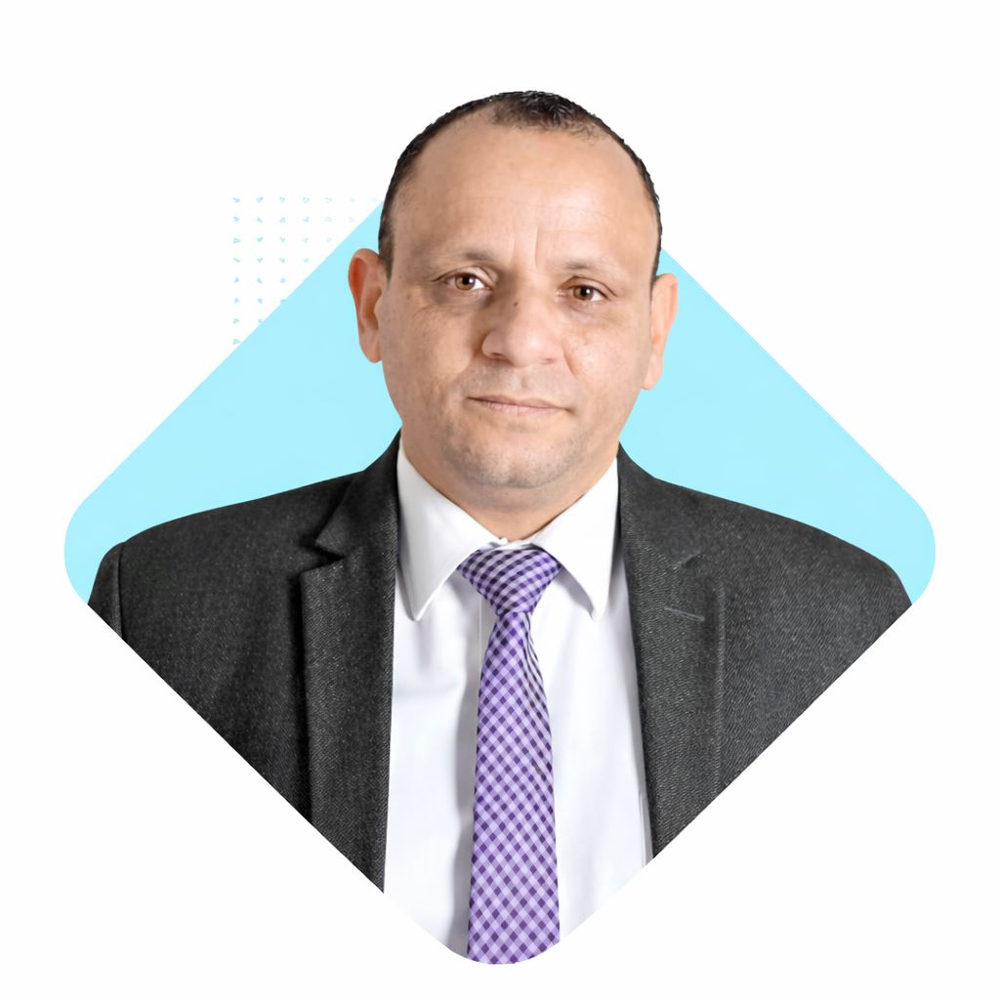

# Amr Mohamed Ahmed - Professional Portfolio Website

A modern, responsive portfolio website for Senior English Language Expert & AUC Certified Trainer.

## 🌟 Features

- **Responsive Design** - Optimized for mobile, tablet, and desktop
- **Three Pillars Approach** - Clear service organization for different audiences
- **Video Integration** - Sample lesson showcase
- **WhatsApp Integration** - Direct contact functionality
- **Modern UI/UX** - Clean, professional design with smooth animations
- **SEO Optimized** - Proper meta tags and semantic HTML
- **Fast Loading** - Optimized performance

## 📁 Project Structure

```
portfolio/
│
├── index.html          # Main homepage
├── style.css           # Complete stylesheet
├── main.js             # JavaScript functionality
├── README.md           # This file
└── assets/             # (Optional) For images/media
    └── images/
        └── profile.jpg # Replace placeholder with actual photo
```

## 🚀 Deployment to Vercel

### Method 1: Drag & Drop (Easiest)

1. Go to [vercel.com](https://vercel.com)
2. Sign up or log in
3. Click "Add New Project"
4. Click "Browse" and select your project folder
5. Click "Deploy"

### Method 2: Vercel CLI

```bash
# Install Vercel CLI
npm install -g vercel

# Navigate to your project directory
cd portfolio

# Deploy
vercel
```

### Method 3: GitHub Integration

1. Create a GitHub repository
2. Push your code to GitHub:
   ```bash
   git init
   git add .
   git commit -m "Initial commit"
   git remote add origin YOUR_GITHUB_REPO_URL
   git push -u origin main
   ```
3. Go to Vercel and import your GitHub repository
4. Vercel will automatically deploy

## 🎨 Customization Guide

### Update Profile Image

Replace the SVG placeholder in `index.html` (line ~60) with:

```html
<div class="image-placeholder">
    
</div>
```

Then add this CSS to `style.css`:

```css
.image-placeholder img {
    width: 100%;
    height: 100%;
    object-fit: cover;
}
```

### Update Contact Information

In `index.html`, search for and update:
- WhatsApp numbers: `201550899245` and `201024394486`
- Email: `amrmohammed4111@gmail.com`
- Telegram: `@01024394486`
- LinkedIn: Update the URL

### Change Color Scheme

In `style.css`, modify the CSS variables (lines 10-15):

```css
:root {
    --navy-blue: #1e3a5f;    /* Primary color */
    --rich-gold: #c9a961;    /* Accent color */
    --crisp-white: #ffffff;  /* Background */
    --slate-gray: #4a5568;   /* Text color */
    --light-gray: #f7fafc;   /* Section backgrounds */
}
```

### Update Video

Replace the YouTube video ID in `index.html` (line ~305):

```html
src="https://www.youtube.com/embed/YOUR_VIDEO_ID"
```

## 📱 Testing Checklist

Before deploying, test:

- ✅ All navigation links work
- ✅ Mobile menu opens/closes properly
- ✅ WhatsApp buttons redirect correctly
- ✅ Video plays properly
- ✅ Contact form submits
- ✅ Responsive design on different screen sizes
- ✅ All social media links work

## 🔧 Browser Compatibility

Tested and working on:
- Chrome 90+
- Firefox 88+
- Safari 14+
- Edge 90+
- Mobile browsers (iOS Safari, Chrome Mobile)

## 📊 Performance Optimization Tips

1. **Compress Images**
   - Use tools like TinyPNG or Squoosh
   - Convert to WebP format for better compression

2. **Enable Caching**
   - Vercel handles this automatically

3. **Lazy Load Images**
   - Already implemented for video

4. **Minify CSS/JS**
   - Use online tools or build process

## 🌐 Custom Domain Setup (Optional)

1. Go to Vercel Dashboard
2. Select your project
3. Go to Settings → Domains
4. Add your custom domain
5. Follow Vercel's DNS configuration instructions

## 📞 Support

For issues or questions about the website:
- Email: amrmohammed4111@gmail.com
- WhatsApp: +20 12 0545 2322

## 📄 License

This website is the property of Amr Mohamed Ahmed.

## 🙏 Credits

Designed and developed following modern web standards and best practices.

---

**Last Updated:** January 2026