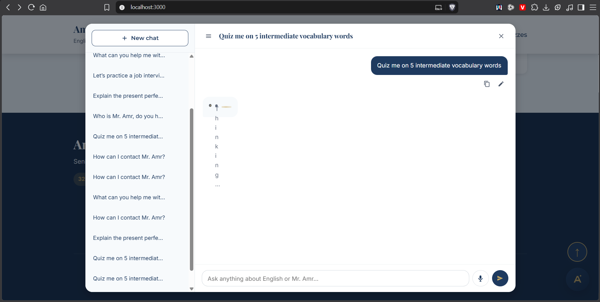
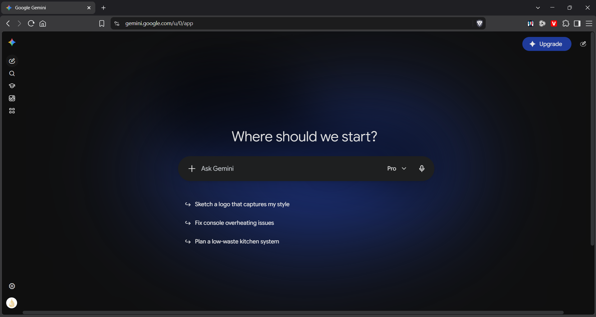
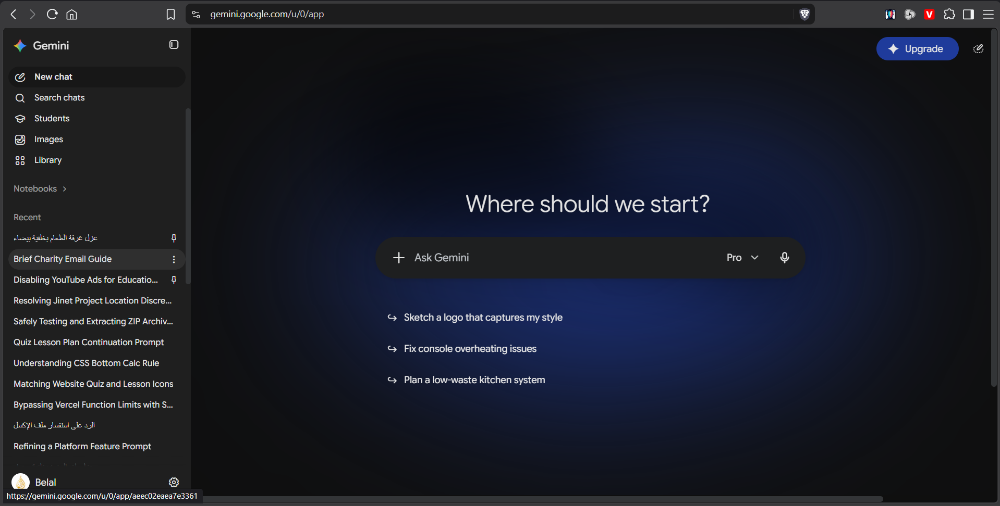

## Platform Improvement

## AI Chat
- Broken Loading animation . The loading animation is broken, it shouldn't display text, it should just be an interactive loading pet/logo.
- Interactive Quizzes: When asked to make a 5-question quiz, it makes one question only, then the next question comes in a new AI response, so instead of making a 5-question quiz as requested, it makes 1 question for 5 reponses.
- Sidebar Design: The sidebar isn't how I intended it to be. I wanted something like Gemini 
    - When Collapsed: The main icons appear, including the AI's logo.
    - When the logo is hovered it should show this icon instead of the logo:
    ```html
    <svg xmlns="http://www.w3.org/2000/svg" width="24" height="24" viewBox="0 0 24 24" fill="none" stroke="currentColor" stroke-width="2" stroke-linecap="round" stroke-linejoin="round" class="lucide lucide-panel-left-open preview-icon"><rect width="18" height="18" x="3" y="3" rx="2"/><path d="M9 3v18"/><path d="m14 9 3 3-3 3"/></svg>
    ```
    - When that icon is presssed, the sidebar gets expanded. The logo is visible, with its name, and this icon, too:
    ```html
    <svg xmlns="http://www.w3.org/2000/svg" width="24" height="24" viewBox="0 0 24 24" fill="none" stroke="currentColor" stroke-width="2" stroke-linecap="round" stroke-linejoin="round" class="lucide lucide-panel-right preview-icon"><rect width="18" height="18" x="3" y="3" rx="2"/><path d="M15 3v18"/></svg>
    ```
    - When that icon is hovered, it shows this
    ```html
    <svg xmlns="http://www.w3.org/2000/svg" width="24" height="24" viewBox="0 0 24 24" fill="none" stroke="currentColor" stroke-width="2" stroke-linecap="round" stroke-linejoin="round" class="lucide lucide-panel-right-open preview-icon"><rect width="18" height="18" x="3" y="3" rx="2"/><path d="M15 3v18"/><path d="m10 15-3-3 3-3"/></svg>
    ```
    - That hover system and sidebar collapsed/expanded is what Gemini has
- Pinned Items :
    - The current design doesn't match Gemini's, and does't do the intended readablility features
    - The more menu should have icons next to each item
    - Overhaul the export features so there is to way to do it (copy directly to clipboard or download as a file).
    - When an item isn't pinned: 
        - Normal State: No button shows, and the item title takes the full width of the item itself to display as much of the title taking advantage of the space
        - Hover State: The more button shows up.
    - When an item is pinned:
        - Normal State: The pin icon shows in place of the more button.
        - Hover State: The more icon shows instead of the pin icon.
- AI Input (Same Gemini Screenshot):
    - The send button and the microphone button should be inside the ai input itself to achieve that seemless experience. And the send button should match, too.
    - There is no way to stop the AI's answer.

## `#navbar`'s Height
- The height of the `#navbar` element at the top of the screen is too much, it should be slim.

## Application
Make the website an installable app.

Online First rules (for users that install the app):
- When the user is only, they always and always pull the code from the host, not the offline cached code. We aren't going to use a service worker version, because I always forget to increament it when updating.
- When the user is offline, the cached code gets displayed with a very tiny offline banner at the bottom of the screen, that has a cancel button.
- When the user is online they always update the cached code.
- Users that didn't instal the app never cache anything at all.