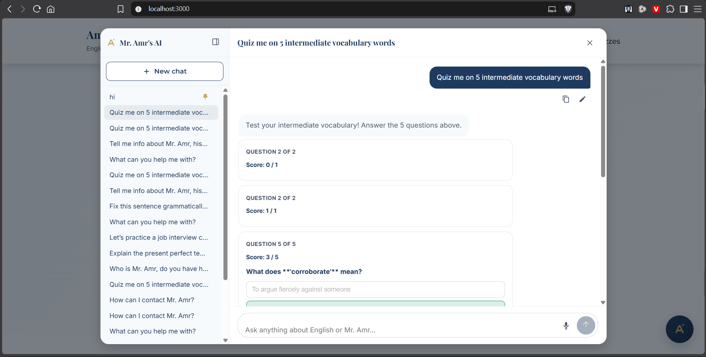

## Platform Improvement

## AI Chat
- The stop AI button still doesn't work; if I click it, the AI doesn't stop, it keeps generating the response.
- The interactive quiz is now messy: . I myself don't even understand the problem with it so far. In the one test I ran after the latest changes, instead of generating a quiz in one card with next and previous buttons to go through the questions, it generated 3 cards, 2 of which where 1-question each, the 3rd was a quiz on its own and a score to it. But then in another test, it generated the quiz correctly, five questions in one card. If the problem is from the model itself not the tooling, try to make the tooling way simpler for the model.

## Application
Make the website an installable app.

Online First rules (for users that install the app):
- When the user is only, they always and always pull the code from the host, not the offline cached code. We aren't going to use a service worker version, because I always forget to increament it when updating.
- When the user is offline, the cached code gets displayed with a very tiny offline banner at the bottom of the screen, that has a cancel button.
- When the user is online they always update the cached code.
- Users that didn't instal the app never cache anything at all.